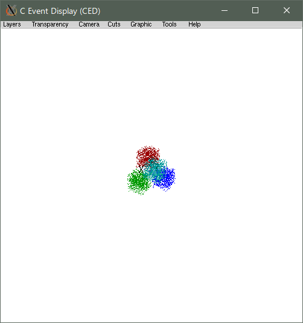

# glced for Windows ced

CED server, `glced.exe`, was built with cygwin Windows and prepared as 
an standalone application. 

## How to download and unpack
 
### Donwload [cygced-v01-09-02.tar.xz](cygCED-v01-09-02.tar.xz) 
sha256sum and md5sum of the file is as follows.
```
$ sha256sum cygCED-v01-09-02.tar.xz
15de73b469e4ccf63eb6ee8334be54298e9b23cf793fb472c09ab6be081eecd8  cygCED-v01-09-02.tar.xz

$ md5sum cygCED-v01-09-02.tar.xz
2c4dc6aaa15f3e4bc031da981765e98e  cygCED-v01-09-02.tar.xz
```
### Unpack it and add the directory to your command path.
```
$ tar Jxf cygCED-v01-09-02.tar.xz
```

### Test run 
```
$ export PATH=${PWD}/cygced-v01-09-02:${PATH}
$ glced.exe & 
$ glced_hits.exe
```

`glced.exe` opens a new windows of the glced server.
`glced_hits.exe` is a glced client for test and shows
a figure as shown below. 


 
